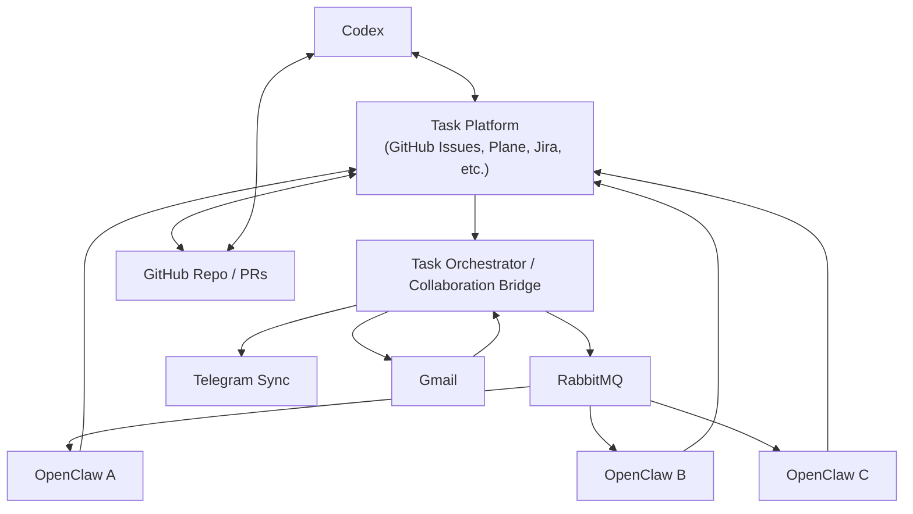

# OpenClaw Multi-Agent Collaboration Workflow Notes

This document summarizes the current design discussion for coordinating multiple
OpenClaw agents, Codex, GitHub, Telegram, RabbitMQ, Gmail, and a future
task/work-item platform.

The focus is still exploratory. No implementation decision is final yet.

## Current Context

- There are currently 3 OpenClaw agents.
- Human-to-agent communication is currently visible through Telegram.
- Agent-to-agent communication currently uses RabbitMQ.
- Each OpenClaw agent has its own RabbitMQ channel/inbox.
- Each OpenClaw agent also has GitHub and Gmail access.
- The Python `openclaw-agent` project is intended to improve OpenClaw's
  computer-use capability.
- The Python agent must eventually run cross-platform, especially Ubuntu first
  and Windows soon.

## Main Design Concern

RabbitMQ is good at delivering messages, but it is not a durable task/workflow
system by itself.

The main failure mode observed is:

1. A message is sent to an OpenClaw agent through RabbitMQ.
2. The message is consumed from the queue.
3. The OpenClaw agent does not fully understand the task details, or fails to
   continue the workflow.
4. The message is already gone from the queue.
5. The task effectively stalls at that agent.

This suggests RabbitMQ should not be the source of truth for task details or
task state.

## Core Principle

Use the task platform as the source of truth.

Use RabbitMQ only as a wakeup/notification mechanism.

```text
Task Platform = Durable task details, state, owner, history, acceptance criteria
RabbitMQ = Wakeup signal / dispatch notification
Telegram = Human-visible mirror and intervention channel
GitHub = Code, issues, PRs, reviews, commit history
Gmail = Async notification and external communication
OpenClaw = Worker that pulls assigned tasks from the task platform
Codex = Reviewer, implementer, workflow designer, or coding collaborator
```

## Recommended High-Level Architecture



## Channel Responsibilities

| Channel | Responsibility |
| --- | --- |
| Task platform | Durable work item source of truth |
| GitHub Issues/Projects | Development tasks, PR linkage, reviews, engineering history |
| Plane/Jira | More formal work-item board and workflow state machine |
| RabbitMQ | Notify an agent that a task needs attention |
| Telegram | Sync important events to the human operator |
| Gmail | Async notifications, summaries, external communication |
| GitHub PRs | Code collaboration, review, merge history |

## RabbitMQ Message Design

RabbitMQ messages should be small and should not contain the full task.

Preferred message:

```json
{
  "type": "task.wakeup",
  "task_id": "OC-123",
  "assignee": "openclaw-a",
  "source": "github",
  "url": "https://github.com/org/repo/issues/123",
  "reason": "assigned_or_updated",
  "revision": 7
}
```

The receiving OpenClaw should then fetch the full task details from the task
platform.

## Task State Model

Suggested states:

```text
Backlog
Ready
Assigned
Queued
Claimed
In Progress
Needs Clarification
Blocked
Needs Review
Done
Stalled
Reassign
```

Important distinction:

```text
Acknowledged = I saw this task
Queued = I saw this task, but I am busy and will handle it later
Claimed = I am about to start this task and have a lease
In Progress = I am actively working on this task
```

This distinction avoids confusing "the agent saw the task" with "the agent is
currently working on the task".

## Handling New Tasks While an Agent Is Busy

If an OpenClaw receives a RabbitMQ notification while already working on another
task, it should not ignore the notification and should not immediately start the
new task.

Instead:

1. Fetch assigned tasks from the task platform.
2. Determine that it is currently busy.
3. Mark the new task as `Queued` or acknowledge it as queued.
4. Continue the current task.
5. After finishing the current task, fetch the next queued/assigned task.
6. Claim and process the next task.

Suggested busy acknowledgement:

```json
{
  "event": "task.acknowledged",
  "task_id": "OC-124",
  "agent": "openclaw-a",
  "agent_state": "busy",
  "current_task_id": "OC-123",
  "new_status": "Queued",
  "estimated_start": "after_current_task"
}
```

Suggested idle claim:

```json
{
  "event": "task.claimed",
  "task_id": "OC-124",
  "agent": "openclaw-a",
  "new_status": "In Progress",
  "lease_until": "2026-04-23T14:30:00+08:00"
}
```

## Agent Worker Loop

Each OpenClaw should behave like a worker with its own durable queue state, not
like a one-shot RabbitMQ consumer.

Suggested loop:

```text
on RabbitMQ wakeup:
  sync_assigned_tasks()
  if idle:
    claim_next_task()
  else:
    mark_new_tasks_queued()

on current task finished:
  mark_done()
  claim_next_task()

on heartbeat interval:
  renew_current_lease()
  sync_assigned_tasks()
  if idle:
    claim_next_task()
```

## Lease And Watchdog

`Claimed` and `In Progress` tasks should have leases.

The purpose of a lease is to prevent tasks from staying permanently stuck on an
agent that crashed, misunderstood the task, or stopped reporting progress.

Suggested fields:

```json
{
  "task_id": "OC-123",
  "status": "In Progress",
  "lease_owner": "openclaw-a",
  "lease_until": "2026-04-23T14:30:00+08:00",
  "current_attempt": 2,
  "last_heartbeat_at": "2026-04-23T14:20:00+08:00"
}
```

A watchdog should periodically scan for:

- `Claimed` tasks with expired leases.
- `In Progress` tasks with expired leases.
- `Queued` tasks that have not moved for too long.
- Tasks with no acknowledgement after assignment.
- Tasks that repeatedly fail understanding checks.

Possible watchdog actions:

- Mark task as `Stalled`.
- Notify Telegram.
- Reassign to another OpenClaw.
- Ask human for clarification.
- Ask Codex or another agent to review the situation.

## Required First Response From Agents

When an OpenClaw first acknowledges a task, it should write back a structured
understanding before doing substantial work.

Example:

```json
{
  "task_id": "OC-123",
  "agent": "openclaw-windows",
  "event": "acknowledged",
  "understanding": "Make the Python openclaw-agent boot on Windows by isolating Linux-only imports and using Windows-compatible backends.",
  "plan": [
    "Check import failures",
    "Add Windows-safe screen backend",
    "Use pynput for mouse and keyboard",
    "Run a startup smoke test"
  ],
  "confidence": 0.82,
  "blockers": []
}
```

For important tasks, this understanding can be reviewed by the human operator,
another OpenClaw, or Codex before the task moves to `In Progress`.

## Suggested Task Schema

```json
{
  "task_id": "OC-123",
  "title": "Make openclaw-agent boot on Windows",
  "assignee": "openclaw-windows",
  "status": "Queued",
  "priority": 50,
  "created_at": "2026-04-23T13:00:00+08:00",
  "updated_at": "2026-04-23T13:05:00+08:00",
  "lease_owner": null,
  "lease_until": null,
  "current_attempt": 1,
  "depends_on": [],
  "acceptance_criteria": [
    "python main.py starts on Windows",
    "screen_capture works via mss on Windows",
    "mouse and keyboard use a Windows-compatible backend"
  ],
  "last_agent_event": {
    "type": "acknowledged",
    "agent": "openclaw-a",
    "current_task_id": "OC-122"
  }
}
```

## Platform Options

### GitHub Issues And Projects

Pros:

- Natural fit for software development.
- PRs, reviews, commits, issues, and comments are connected.
- OpenClaw agents already have GitHub accounts.
- Codex can naturally collaborate through issues, PRs, code review, and local
  implementation.

Potential concern:

- GitHub Projects is usable as a board, but less workflow-heavy than Jira.

### Plane

Pros:

- More similar to Linear/Jira.
- Open-source/self-host friendly.
- Better suited if a dedicated task board is desired.

Potential concern:

- Requires running and integrating another service.

### Jira

Pros:

- Strong workflow state machine.
- Mature issue tracking model.

Potential concern:

- Heavier setup and integration cost.
- May be more than needed for the first version.

## Suggested MVP

The first version does not need a full custom Slack/Jira clone.

Suggested MVP:

1. Use GitHub Issues/Projects or Plane as the durable task platform.
2. Build a small task orchestrator / collaboration bridge.
3. The bridge listens to task assignment/update events.
4. The bridge sends RabbitMQ wakeup messages to the assigned OpenClaw.
5. Each OpenClaw fetches task details from the task platform.
6. Each OpenClaw writes acknowledgement, plan, heartbeat, status, and results
   back to the task platform.
7. The bridge mirrors important updates to Telegram.
8. A watchdog handles expired leases and stalled tasks.

## How Codex Can Participate

Codex can participate through the task platform and GitHub workflow.

Possible roles:

- Reviewer: review OpenClaw's understanding, plan, code, PR, or result.
- Implementer: take an assigned issue and modify the local repository.
- Workflow designer: help define schemas, states, RabbitMQ events, and bridge
  behavior.
- Debugging partner: inspect why a task stalled and suggest recovery.

Suggested trigger patterns:

- Add a label such as `codex-needed`.
- Mention `codex` in a task comment.
- Assign a GitHub issue to a Codex-specific workflow.
- Ask the human operator to paste the issue/PR context into a Codex thread.

## Open Questions

- Which platform should be the first durable task source: GitHub Issues,
  GitHub Projects, Plane, or Jira?
- Should `Queued` be represented as a global task status, a per-agent queue
  field, or both?
- Should OpenClaw agents be allowed to work on more than one task concurrently?
- How long should a lease last before a task becomes `Stalled`?
- Who reviews the first understanding response for high-risk tasks?
- Should task priority be global, per-agent, or manually controlled?
- Should dependency handling be implemented early, or deferred?
- What should happen if RabbitMQ notification is missed but the task is already
  assigned?
- How often should agents poll assigned/queued tasks even without RabbitMQ
  wakeup?
- How much should Telegram expose: all events, only important events, or
  operator-configurable filters?

## Current Working Conclusion

The best direction is to treat RabbitMQ as a notification mechanism only.

The durable task system should hold task details, ownership, state, queueing,
leases, history, understanding summaries, acceptance criteria, and completion
results.

Each OpenClaw should acknowledge tasks, queue them if busy, claim them only when
ready to work, send heartbeats while working, and fetch the next queued task
after finishing the current one.

